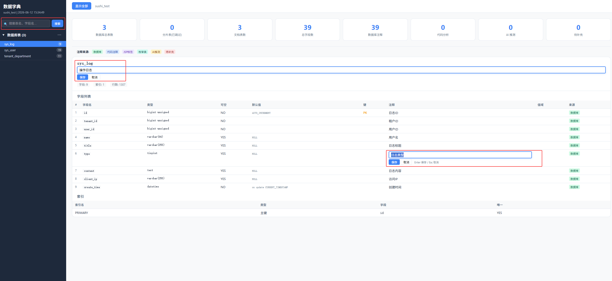

# Sushi Data Dictionary Claude Code Skill

[](LICENSE)
[](https://www.python.org/)
[](https://claude.ai/code)

连接 MySQL 数据库，结合 Java 项目代码智能分析，生成带搜索和在线编辑功能的数据字典文档。

项目地址：https://github.com/nullhe/Sushi_data_dictionary-Skill

真正的 Skill 位于：
```bash
sushi-data-dictionary-skill/
```

## 功能特性

- **数据库元数据提取** — 自动读取所有表结构、字段、索引、外键关系
- **分片表识别** — 自动识别并跳过分片表（`_slice\d+`），避免重复文档
- **Java 实体类解析** — 解析 `@TableName`、`@TableField`、Javadoc 注释，提取字段映射
- **智能注释补全** — 从实体类、枚举类、JSP 前端、Mapper XML 多来源补全缺失注释
- **HTML 总览页** — 侧边栏搜索、按首字母排序、统计面板、注释来源标签高亮
- **在线编辑** — 点击字段/表注释直接编辑，保存后同步到 .md 文件
- **IPv4/IPv6 双栈** — 服务器同时监听 IPv4 和 IPv6，兼容所有浏览器

## 演示截图

| 功能演示                        | 
|-----------------------------|
|  |


## 快速开始

### 安装

将 skill 目录复制到 Claude Code 的 skills 路径：

```bash
# 克隆仓库
git clone https://github.com/hepy/Sushi_data_dictionary-Skill.git

# 将 sushi-data-dictionary-skill 复制到 Claude Code skills 目录
cp -r sushi-data-dictionary-skill ~/.claude/skills/db-dict
```

目录结构应为：
```
.
├── demo（生成demo）/
│   ├── index.html
│   ├── server.py
│   ├── summary.md
│   └── tables/
│       ├── sys_log.md
│       ├── sys_user.md
│       └── tenant_department.md
├── sushi-data-dictionary-skill（实际skill）/
│   ├── SKILL.md
│   └── scripts/
│       ├── generate_html.py
│       ├── server.py
│       └── template.html
└── image（演示截图）/
    ├── demo01.png
    ├── demo02.png
    ├── demo03.png
    ├── demo04.png
    ├── demo05.png
    ├── demo06.png
    └── demo07.png
```

### 使用

在 Claude Code 中输入：

```
/db-dict
```

Claude 会交互式询问数据库连接信息，然后自动完成全部工作。

### 参数说明

| 参数 | 说明 | 默认值 |
|------|------|--------|
| host | 数据库主机 | localhost |
| port | 端口 | 3306 |
| user | 用户名 | root |
| password | 密码 | 交互输入 |
| database | 数据库名 | 必填 |
| tables | 表名过滤（支持 `*`） | 所有表 |
| server-port | 本地编辑服务器端口 | 8080 |

密码可通过环境变量预设：`DB_DICT_HOST`、`DB_DICT_PORT`、`DB_DICT_USER`、`DB_DICT_PASS`、`DB_DICT_DB`

## 输出示例

```
docs/data-dictionary/
├── index.html              # HTML 总览页（带搜索/筛选/在线编辑）
├── summary.md              # 统计摘要
├── server.py               # 本地编辑服务器
└── tables/
    ├── order_info.md       # 每表一个 Markdown 文件
    ├── stock_info.md
    └── ...
```

### HTML 页面功能

- 左侧边栏：数据库表 + 项目实体两个分区，按字母 A-Z 排序
- 搜索：支持表名、字段名、注释内容搜索
- 统计面板：总表数、字段数、注释覆盖率
- 注释来源标签：数据库（绿）、代码推断（蓝）、AI 推测（橙）、待补充（红）
- 在线编辑：点击注释即可修改，保存后同步到 .md 文件

### 启动编辑服务器

```bash
cd docs/data-dictionary
python server.py 
# 默认端口为8080，指定端口启动 python server.py --port xxxx
# 浏览器打开 http://localhost:8080
```

## 技术栈

- **Python 3.6+** — 仅使用标准库，无外部依赖
- **MySQL** — 通过 `information_schema` 提取元数据
- **HTML/CSS/JS** — 纯原生实现，无框架依赖

## 适用场景

- Java MyBatis/MyBatis-Plus 项目（支持 `@TableName`、`@TableField` 注解解析）
- 任何 MySQL 数据库（即使没有 Java 代码，也能基于数据库注释生成字典）
- 需要快速了解数据库全貌、补充数据库字典的团队

## 支持一下
**⭐ 如果这个项目对你有帮助，请给一个 Star！⭐**

## 开源协议
本项目采用 [MIT License](LICENSE) 开源。你可以自由使用、复制、修改、分发，也可以基于它继续开发自己的版本。

使用者仍需自行核对生成材料是否符合实际项目和官网当前要求。

